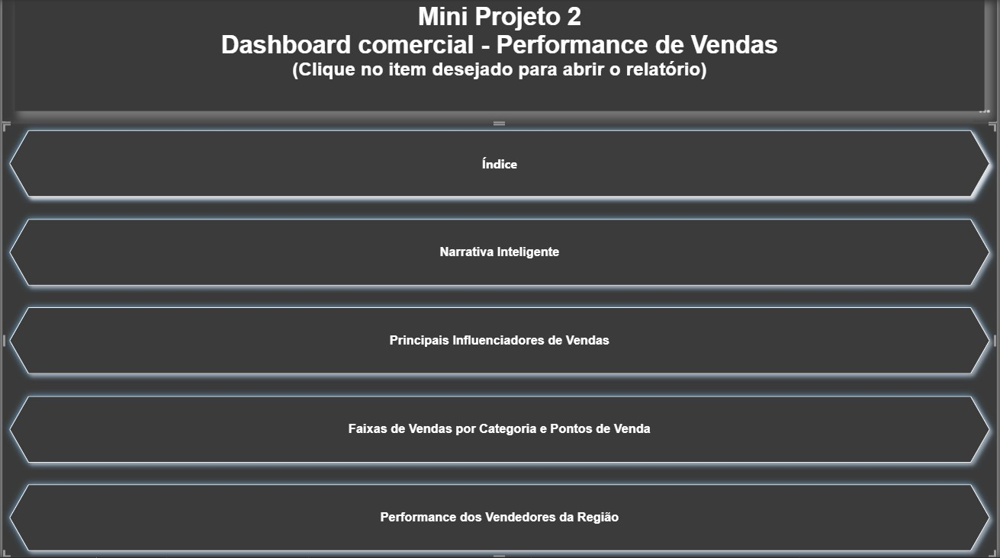
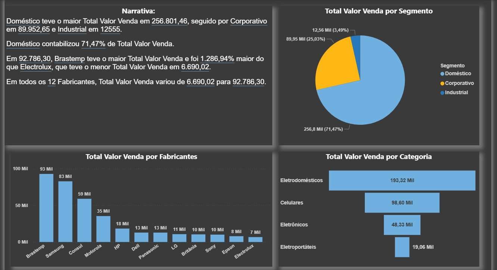
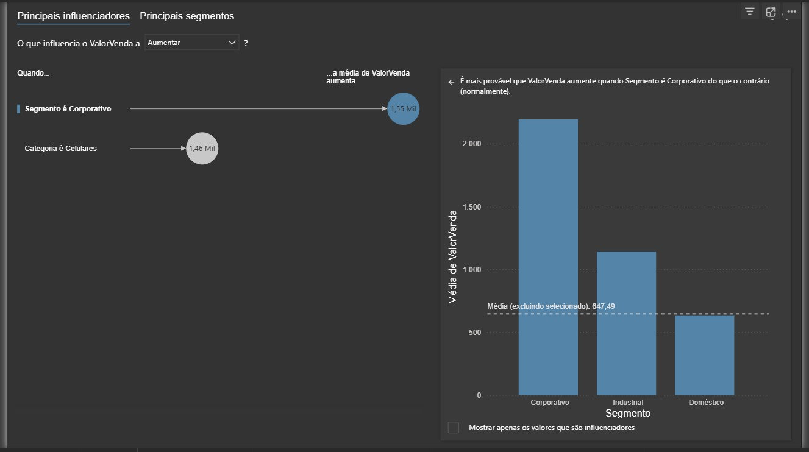
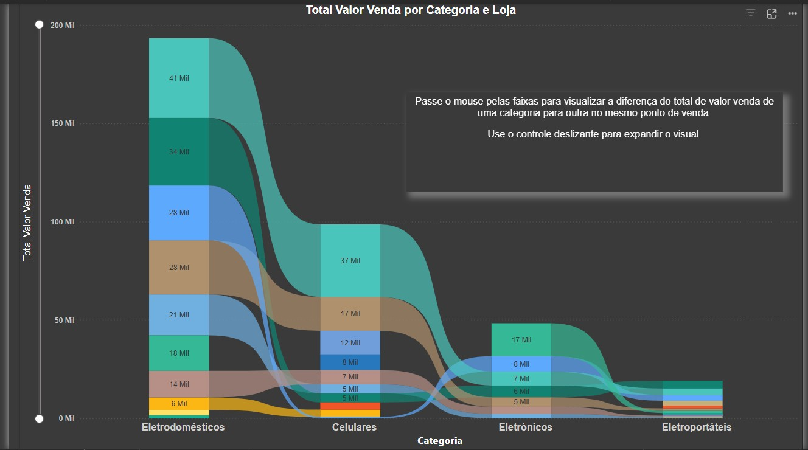
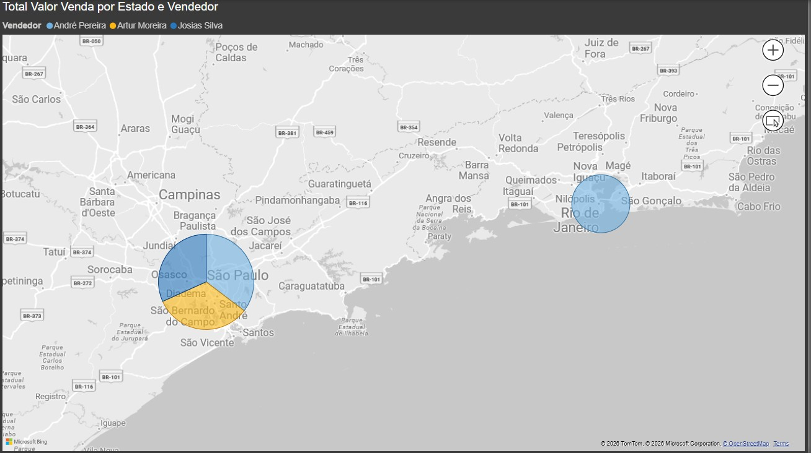

# 📊 Dashboard Comercial - Performance de Vendas | Power BI

Projeto desenvolvido em Power BI com foco na análise de performance de vendas, identificação de padrões de consumo e fatores que influenciam o valor das vendas.

---

## 📚 Contexto do Projeto

Projeto desenvolvido durante o curso de Power BI da Data Science Academy (DSA), com aplicação prática de ETL, modelagem de dados e DAX, incluindo análises e interpretações voltadas para tomada de decisão de negócio.

---

## 📷 Preview

### 📑 Índice do Dashboard

### 🧠 Narrativa Inteligente

### 🎯 Principais Influenciadores de Vendas

### 📊 Faixas de Vendas por Categoria e Loja

### 🌍 Performance dos Vendedores por Região

---

## 🎯 Objetivo

Analisar o desempenho comercial identificando:

* Categorias mais relevantes
* Segmentos mais lucrativos
* Regiões com maior performance
* Fatores que influenciam o valor das vendas

---

## ❓ Perguntas de Negócio

### 1. Qual segmento gera maior valor de vendas?

* Segmento **Doméstico** representa cerca de **71% do faturamento total**
* Segmento Corporativo aparece em segundo lugar

👉 Indica forte dependência do segmento doméstico.

---

### 2. Quais categorias de produtos geram mais receita?

* **Eletrodomésticos** lideram com ~193 mil
* Seguido por **Celulares** (~98 mil)

👉 Mostra concentração de receita em poucas categorias.

---

### 3. Quem são os fabricantes com melhor desempenho?

* **Brastemp** lidera com maior volume de vendas
* Seguida por Samsung e Consul

👉 Indica marcas-chave para estratégia comercial.

---

### 4. O que mais influencia o aumento do valor de venda?

* Segmento **Corporativo** aumenta significativamente o ticket médio
* Categoria **Celulares** também impacta positivamente

👉 Insights diretos para estratégias de pricing e vendas.

---

## 📈 Principais Insights

* Forte concentração de receita no segmento doméstico
* Poucas categorias dominam o faturamento
* Fabricantes específicos lideram o mercado
* Segmentação impacta diretamente o valor das vendas
* Existe potencial para diversificação de receita

---

## 🧠 Ferramentas e Técnicas Utilizadas

### 🔹 Power Query (ETL)

* Limpeza e transformação dos dados
* Padronização das categorias e segmentos
* Preparação da base analítica

---

### 🔹 Modelagem de Dados

* Estrutura otimizada para análise de vendas
* Relacionamento entre produtos, fabricantes e regiões

---

### 🔹 DAX (Cálculos)

Utilizado para:

* Total de vendas
* Média de valor por venda
* Análise por segmento
* Indicadores de performance

---

### 🔹 Recursos Avançados do Power BI

#### 📌 Narrativa Inteligente

* Geração automática de insights
* Resumo textual dos dados

#### 📌 Principais Influenciadores

* Identificação de variáveis que impactam vendas
* Análise preditiva simplificada

#### 📌 Gráfico de Faixas (Ribbon Chart)

* Comparação entre categorias ao longo do tempo
* Visualização de mudanças de ranking

#### 📌 Mapa Geográfico

* Análise de performance por região
* Identificação de concentração de vendas

---

## 💡 Por que esses indicadores?

Os indicadores foram escolhidos para responder diretamente às decisões comerciais:

* **Segmento de vendas** → onde está o dinheiro
* **Categoria de produto** → o que vender mais
* **Fabricante** → quem performa melhor
* **Região** → onde focar esforços
* **Influenciadores** → por que as vendas aumentam

👉 Permite entender **o que vender, para quem e onde**

---

## 📁 Arquivos do Projeto

* `dashboard.pbix` → Arquivo Power BI
* `faixas-categoria.jpg` → Faixas de vendas
* `indice.jpg` → Navegação do dashboard
* `narrativainteligente.jpg` → Insights automáticos
* `performance-regiao.jpg` → Mapa de vendas
* `principais-influenciadores.jpg` → Análise de drivers

---

## 🛠️ Tecnologias Utilizadas

* Power BI
* DAX
* Power Query
* Modelagem de Dados

---

## 👨‍💻 Autor

Thiago Sperate 😎
Analista de Dados 📊

📎 [LinkedIn](https://www.linkedin.com/in/thiagosperate/)
📁 [Portfólio](https://github.com/ThSperate)
